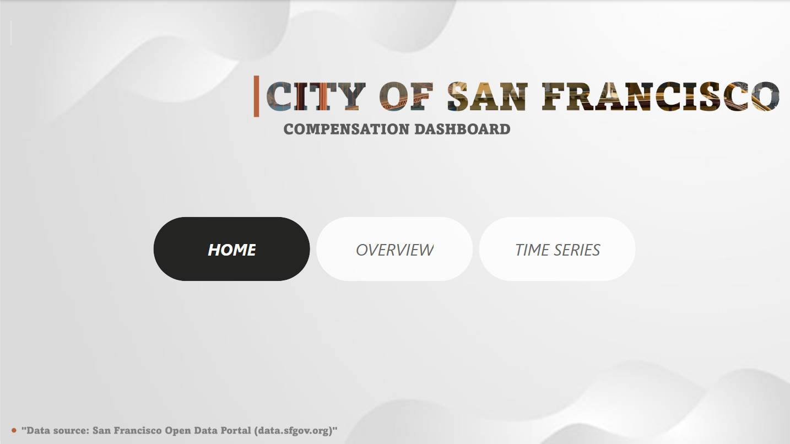
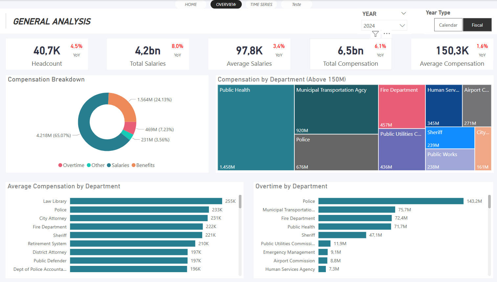
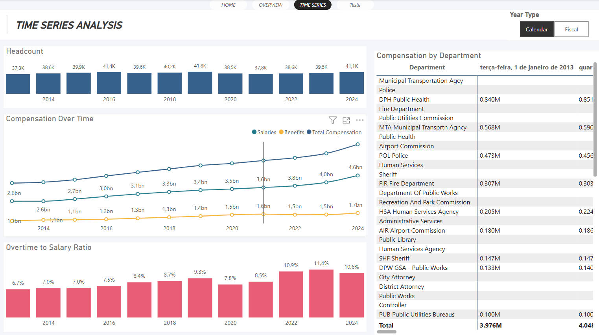

# Dashboard Remuneracao

📌 Neste projeto constam arquivos utilizados para desenvolver um dashboard para análise da remuneração dos funcionários públicos de San Francisco/CA

Local Download Arquivo CSV com dados reais: https://data.sfgov.org/City-Management-and-Ethics/Employee-Compensation/88g8-5mnd/about_data

## Ferramentas usadas
- Python
- Power BI

## Objetivo do Treinamento
- ETL com python
- Modelagem em linguagem M
- Formulas DAX
- Visual

